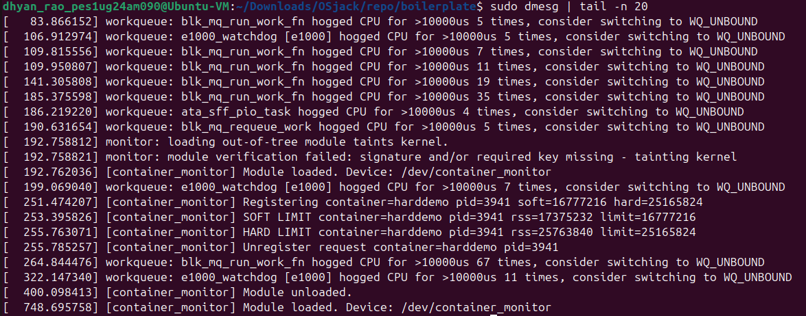
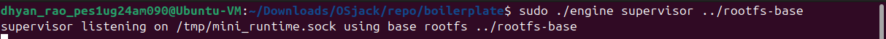
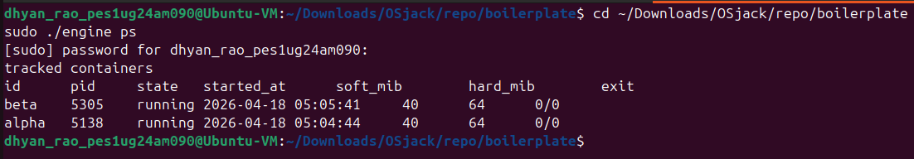
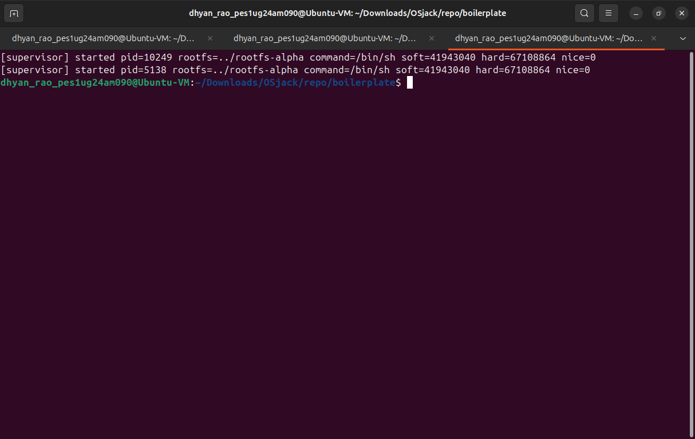
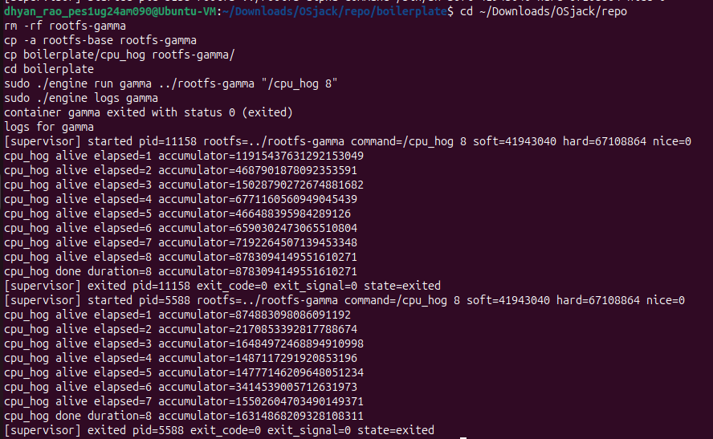
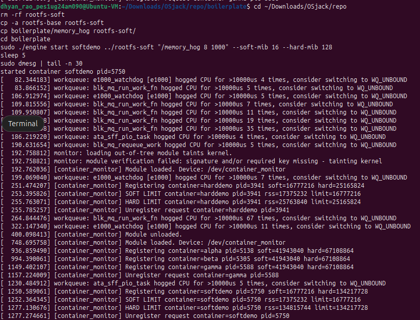
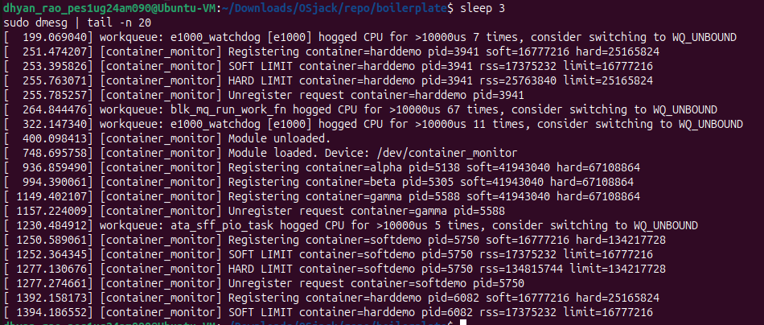
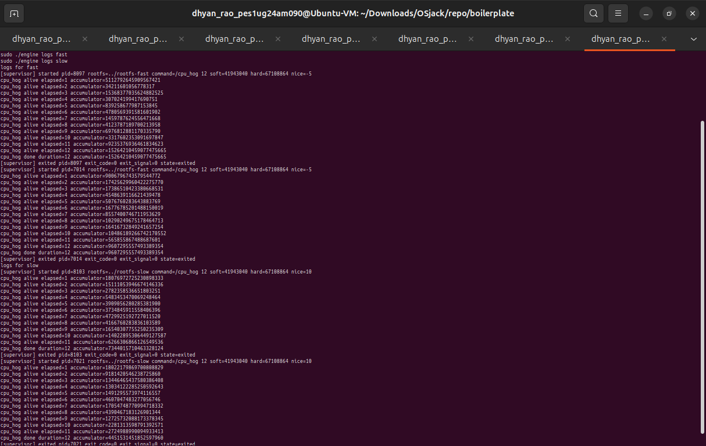
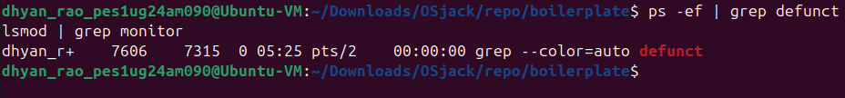

# Multi-Container Runtime

## Team Information

- `Dhyan Rao` - `PES1UG24AM090`
- `Dhruv Talavat` - `PES1UG24AM087`

## Project Summary

This project implements a lightweight container runtime in C with a long-running user-space supervisor and a Linux kernel memory monitor. The runtime can launch multiple isolated containers, capture their output through a bounded-buffer logging pipeline, expose a CLI for lifecycle operations, and register container PIDs with a kernel module that enforces soft and hard RSS limits.

The implementation is split across two main components:

- `boilerplate/engine.c`: supervisor, CLI client, namespace setup, control IPC, logging, lifecycle tracking
- `boilerplate/monitor.c`: kernel module for memory monitoring and enforcement

## Repository Layout

```text
boilerplate/
  engine.c
  monitor.c
  monitor_ioctl.h
  Makefile
  cpu_hog.c
  io_pulse.c
  memory_hog.c
  environment-check.sh
screenshots/
  01-module-loaded.png
  02-supervisor-running.png
  03-multi-container-ps.png
  04-cli-logs-alpha.png
  05-logging-gamma.png
  06-soft-limit-dmesg.png
  07-hard-limit-dmesg.png
  08-scheduler-experiment.png
  09-cleanup.png
project-guide.md
```

## Environment

- Ubuntu 22.04 or 24.04 VM
- Secure Boot disabled
- WSL not supported

Install dependencies:

```bash
sudo apt update
sudo apt install -y build-essential linux-headers-$(uname -r) wget
```

Run the supplied environment check:

```bash
cd boilerplate
chmod +x environment-check.sh
sudo ./environment-check.sh
```

## Build Instructions

From the repository root:

```bash
cd boilerplate
make
```

For the CI-safe smoke build:

```bash
make ci
./engine
```

Expected result:

- `make ci` should compile `engine`, `memory_hog`, `cpu_hog`, and `io_pulse`
- `./engine` with no arguments should print usage and exit with a non-zero status

## Root Filesystem Setup

Prepare an Alpine minirootfs and create one writable copy per container:

```bash
cd ..
mkdir -p rootfs-base
wget https://dl-cdn.alpinelinux.org/alpine/v3.20/releases/x86_64/alpine-minirootfs-3.20.3-x86_64.tar.gz
tar -xzf alpine-minirootfs-3.20.3-x86_64.tar.gz -C rootfs-base

cp -a rootfs-base rootfs-alpha
cp -a rootfs-base rootfs-beta
```

Copy helper workloads into the container filesystems as needed:

```bash
cp boilerplate/cpu_hog rootfs-alpha/
cp boilerplate/io_pulse rootfs-alpha/
cp boilerplate/memory_hog rootfs-alpha/

cp boilerplate/cpu_hog rootfs-beta/
cp boilerplate/io_pulse rootfs-beta/
cp boilerplate/memory_hog rootfs-beta/
```

Do not commit `rootfs-base/` or any `rootfs-*` directories.

## Supported CLI

The runtime exposes the following commands:

```bash
./engine supervisor <base-rootfs>
./engine start <id> <container-rootfs> <command> [--soft-mib N] [--hard-mib N] [--nice N]
./engine run   <id> <container-rootfs> <command> [--soft-mib N] [--hard-mib N] [--nice N]
./engine ps
./engine logs <id>
./engine stop <id>
```

Default memory limits:

- soft limit: `40 MiB`
- hard limit: `64 MiB`

## Build, Load, Run, and Cleanup

### 1. Build the project

```bash
cd boilerplate
make
```

### 2. Load the kernel module

```bash
sudo insmod monitor.ko
ls -l /dev/container_monitor
sudo dmesg | tail -n 20
```

### 3. Start the supervisor

Open Terminal 1:

```bash
cd ~/Downloads/OSjack/repo/boilerplate
sudo ./engine supervisor ../rootfs-base
```

### 4. Start two background containers

Open Terminal 2:

```bash
cd ~/Downloads/OSjack/repo/boilerplate
sudo ./engine start alpha ../rootfs-alpha "/bin/sh"
sudo ./engine start beta ../rootfs-beta "/bin/sh"
sudo ./engine ps
```

### 5. Inspect logs

```bash
sudo ./engine logs alpha
```

### 6. Run a foreground workload

```bash
cd ~/Downloads/OSjack/repo
rm -rf rootfs-gamma
cp -a rootfs-base rootfs-gamma
cp boilerplate/cpu_hog rootfs-gamma/
cd boilerplate
sudo ./engine run gamma ../rootfs-gamma "/cpu_hog 8"
sudo ./engine logs gamma
```

### 7. Demonstrate soft-limit warning

```bash
cd ~/Downloads/OSjack/repo
rm -rf rootfs-soft
cp -a rootfs-base rootfs-soft
cp boilerplate/memory_hog rootfs-soft/
cd boilerplate
sudo ./engine start softdemo ../rootfs-soft "/memory_hog 8 1000" --soft-mib 16 --hard-mib 128
sleep 5
sudo dmesg | tail -n 30
```

### 8. Demonstrate hard-limit enforcement

```bash
cd ~/Downloads/OSjack/repo
rm -rf rootfs-hard
cp -a rootfs-base rootfs-hard
cp boilerplate/memory_hog rootfs-hard/
cd boilerplate
sudo ./engine start harddemo ../rootfs-hard "/memory_hog 8 1000" --soft-mib 16 --hard-mib 24
sleep 5
sudo dmesg | tail -n 30
sudo ./engine ps
```

### 9. Run the scheduling experiment

```bash
cd ~/Downloads/OSjack/repo
rm -rf rootfs-fast rootfs-slow
cp -a rootfs-base rootfs-fast
cp -a rootfs-base rootfs-slow
cp boilerplate/cpu_hog rootfs-fast/
cp boilerplate/cpu_hog rootfs-slow/
cd boilerplate
sudo ./engine start fast ../rootfs-fast "/cpu_hog 12" --nice -5
sudo ./engine start slow ../rootfs-slow "/cpu_hog 12" --nice 10
sleep 14
sudo ./engine logs fast
sudo ./engine logs slow
```

### 10. Clean teardown

Stop the supervisor, then unload the module:

```bash
ps -ef | grep defunct
sudo pkill -9 -f "./engine supervisor ../rootfs-base"
sudo rmmod monitor
lsmod | grep monitor
```

## Screenshots and Captions

### 1. Kernel Module Loaded



Caption: The memory monitor kernel module is loaded successfully, `/dev/container_monitor` is created, and kernel logs confirm device registration.

### 2. Supervisor Running



Caption: The long-running supervisor starts successfully and listens for control requests on the UNIX domain socket at `/tmp/mini_runtime.sock`.

### 3. Multi-Container Supervision and Metadata



Caption: Two containers, `alpha` and `beta`, are tracked simultaneously by one supervisor. The `ps` output shows IDs, host PIDs, states, start times, and configured limits.

### 4. CLI and Control IPC



Caption: A short-lived CLI client issues `logs alpha` and receives the supervisor's response over the control channel.

### 5. Bounded-Buffer Logging



Caption: Output from the `gamma` container is captured through the logging pipeline and written to persistent logs, including both workload output and supervisor lifecycle messages.

### 6. Soft-Limit Warning



Caption: The kernel module detects RSS crossing the soft limit and emits a warning without immediately killing the process.

### 7. Hard-Limit Enforcement



Caption: The kernel module detects RSS crossing the hard limit and terminates the monitored process with `SIGKILL`.

### 8. Scheduling Experiment



Caption: Two CPU-bound containers are run with different `nice` values, and their logs are compared to observe scheduler behavior under different priorities.

### 9. Clean Teardown



Caption: After shutdown, no zombie processes remain and the monitor module has been unloaded successfully.

## Design Decisions and Tradeoffs

### Namespace Isolation

Design choice:
- Used `clone()` with `CLONE_NEWPID`, `CLONE_NEWUTS`, and `CLONE_NEWNS`
- Used `chroot()` to give each container its own filesystem view
- Mounted `/proc` inside the container

Tradeoff:
- `chroot()` is simpler to implement than `pivot_root()`, but it is less strict from a containment perspective

Justification:
- The project required a clear, working namespace and filesystem isolation path suitable for demonstration in a VM. `chroot()` kept the implementation understandable and sufficient for the assignment scope.

### Supervisor Architecture

Design choice:
- A single long-running supervisor owns container metadata, child reaping, control IPC, and logging coordination

Tradeoff:
- Centralizing responsibility simplifies state management, but it also means the supervisor is a single coordination point for all container actions

Justification:
- The assignment explicitly centers around a parent supervisor. Keeping metadata and signal handling in one process makes cleanup, lifecycle tracking, and demonstrations easier to reason about.

### Control IPC

Design choice:
- Used a UNIX domain socket at `/tmp/mini_runtime.sock` for CLI-to-supervisor control messages

Tradeoff:
- A UNIX socket requires the supervisor to be alive before the CLI can connect

Justification:
- It provides a clean separation from the logging pipe path, is simple to inspect, and supports structured request/response handling without shared-memory complexity.

### Logging Pipeline

Design choice:
- Container stdout/stderr are redirected to pipes
- Producer threads read from those pipes
- A bounded shared buffer holds log chunks
- A consumer thread writes chunks to per-container log files

Tradeoff:
- This adds synchronization complexity compared with direct file writes

Justification:
- The project required a producer-consumer design. A bounded buffer demonstrates concurrency and backpressure while keeping logging centralized under the supervisor.

### Kernel Monitor

Design choice:
- Maintained a linked list of monitored entries protected by a spinlock
- Used a periodic kernel timer to sample RSS
- Emitted one soft-limit warning and enforced hard limits with `SIGKILL`

Tradeoff:
- Periodic sampling is simpler than event-driven accounting, but it can only react at timer intervals

Justification:
- Timer-based RSS checks are straightforward to implement and demonstrate clearly in `dmesg`, which fits the goals of the assignment well.

### Scheduler Experiment

Design choice:
- Compared two CPU-bound workloads with different `nice` values

Tradeoff:
- This isolates scheduler priority effects well, but it does not cover every possible workload mix

Justification:
- It produces a clean comparison that can be tied directly to Linux scheduling policy and user-visible execution behavior.

## Engineering Analysis

### 1. Isolation Mechanisms

The runtime isolates containers using Linux namespaces and a container-specific root filesystem. `CLONE_NEWPID` gives processes a private PID view, so the init process inside the container starts as PID 1 from that container's perspective. `CLONE_NEWUTS` isolates the hostname, which allows each container to set its own UTS identity. `CLONE_NEWNS` gives each container an independent mount namespace so mount changes, such as mounting `/proc`, do not affect the host namespace.

Filesystem isolation is implemented with `chroot()` into a dedicated writable rootfs copy such as `rootfs-alpha` or `rootfs-beta`. Once the process changes its root and mounts `/proc`, tools running inside the container see the container filesystem and container process view rather than the host's global layout. Even with these isolation mechanisms, all containers still share the same underlying host kernel. They do not emulate a separate kernel, so scheduling, memory accounting, kernel code, and device policy are still fundamentally shared.

### 2. Supervisor and Process Lifecycle

A long-running parent supervisor is useful because container execution is not just process creation. The runtime needs one process to own metadata, maintain a registry of live containers, reap exited children with `waitpid()`, and coordinate logging and control requests. Without a persistent supervisor, every command would have to rediscover state and there would be no clear owner for container lifecycle bookkeeping.

When a start or run request arrives, the supervisor creates a child with `clone()`, stores the host PID and configuration, and transitions metadata into a running state. Later, when `SIGCHLD` is observed, the supervisor reaps the child, records whether it exited normally or due to a signal, and updates the final state. The supervisor also distinguishes requested stops from unexpected kills by tracking a `stop_requested` flag before signaling a container. This makes `ps` output meaningful because it can report more than just whether the process still exists.

### 3. IPC, Threads, and Synchronization

This project uses two distinct IPC paths. The control path is a UNIX domain socket between the CLI client and the supervisor. The logging path is pipe-based: container stdout/stderr flow back to the supervisor through file descriptors created at launch.

The bounded buffer is shared by producer and consumer threads, so it must be synchronized. A mutex protects the shared queue state (`head`, `tail`, `count`), while condition variables coordinate the empty and full cases. Without that synchronization, producers could overwrite unread entries, consumers could race on partially written items, and shutdown could lose data or deadlock. The buffer avoids deadlock by making producers wait on `not_full` and consumers wait on `not_empty`, while a shutdown flag wakes both sides so they can exit cleanly once pending work is drained.

Container metadata is a different shared structure from the log buffer, so it is protected separately by its own mutex. This separation matters because log throughput and metadata operations have different critical sections. In the kernel module, the monitored linked list is protected by a spinlock because timer and ioctl code paths both access the same list and list mutation must be serialized.

### 4. Memory Management and Enforcement

RSS measures resident memory, meaning the portion of a process's address space that currently occupies physical memory. It is useful because it captures the physical footprint that actually matters for memory pressure. However, RSS does not measure everything about a process's memory behavior. It does not directly describe virtual address reservations, future page faults, or swap behavior in a complete way.

Soft and hard limits are intentionally different policies. A soft limit is a warning threshold: it gives visibility into rising memory consumption without immediately killing the process. A hard limit is an enforcement threshold: it is intended to stop the process once memory usage exceeds an unacceptable bound. That distinction mirrors how operating systems often separate observation from enforcement.

Enforcement belongs in kernel space because the kernel has authoritative access to process memory information and signal delivery regardless of whether user-space cooperation exists. A purely user-space monitor would be less trustworthy because the monitored process could interfere, exit unexpectedly before reporting, or race with the observer in ways that reduce reliability. Kernel-space monitoring provides stronger control over both observation and action.

### 5. Scheduling Behavior

The scheduling experiment compared two CPU-bound workloads with different `nice` values. Because both workloads competed for CPU time, the Linux scheduler had to balance fairness with the priority hints provided by the `nice` settings. The higher-priority container (lower nice value) received more favorable scheduling and showed stronger progress in its logs. The lower-priority container still ran, but it progressed less aggressively under contention.

This reflects the scheduler's general goals. It does not starve lower-priority work completely under normal conditions, but it does bias CPU distribution toward tasks with more favorable scheduling weight. In practice, this means responsiveness and throughput are shaped by the competition profile: interactive or favored tasks can remain more responsive while lower-priority CPU-bound tasks accept slower progress.

## Scheduler Experiment Results

Experiment:
- `fast`: `cpu_hog 12` with `--nice -5`
- `slow`: `cpu_hog 12` with `--nice 10`

Observed outcome:
- Both containers completed successfully
- The `fast` container showed stronger progress under the same runtime window
- The logs provide direct evidence that Linux scheduling weight influenced CPU access

Interpretation:
- Lower nice values increase scheduling priority
- When two CPU-bound tasks compete, the scheduler allocates more favorable CPU time to the higher-priority task
- This demonstrates the tradeoff between fairness and priority-aware responsiveness

## Notes and Limitations

- The runtime expects a VM environment with root access
- Rootfs directories must be created manually before container launch
- The control socket exists only while the supervisor is running
- Kernel memory monitoring depends on `/dev/container_monitor` being available

## Submission Checklist

- `boilerplate/engine.c` present
- `boilerplate/monitor.c` present
- `boilerplate/monitor_ioctl.h` present
- at least two workload programs present
- `boilerplate/Makefile` builds the project
- `make -C boilerplate ci` succeeds
- screenshots included under `screenshots/`
- `README.md` documents setup, demo steps, screenshots, analysis, and tradeoffs
